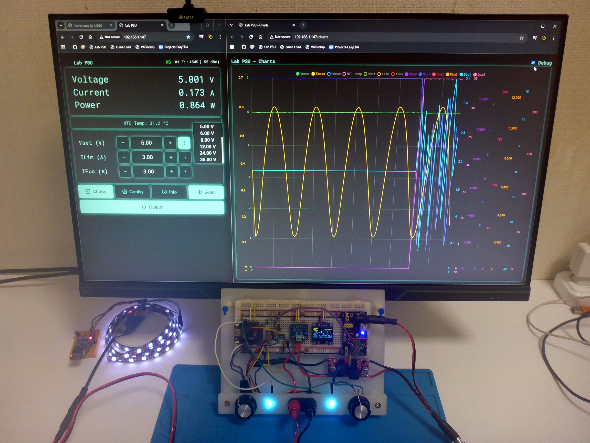
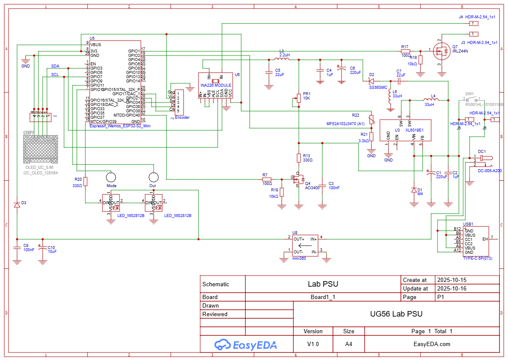

---

---

# ⚡ DIY $10 Smart Lab Power Supply (ESP32)



> Turn any dusty DC-DC converter into a *smart* lab power supply with Wi-Fi, PID control, charts, and personality.
> 
> Because what kind of hacker, scientist, or inventor wouldn’t want a PSU that argues with itself, lives its own life, yet somehow burns nothing anymore?
> It’s more than a lab power supply — it’s a platform for experiments, a set of modular, reusable blocks ready to power whatever crazy idea you solder together next.

---

## 💡 Overview

> **This is an open-source ESP32 controller** that gives brains to analog DC-DC converters (XL6019, LM2596, XL4015, etc.).
> No fancy DACs — just PWM, one MOSFET, one capacitor, and a pinch of chaos.
> And if you’d rather control a linear PSU or swap PWM for a DAC — my code won’t mind.
> A few lines of code, and even Alexa can tweak the current while all three of your hands are busy.

You get:

* Voltage & current control (CV/CC) with PID
* Live charts and web dashboard
* Wi-Fi control & OTA updates
* OLED or LED UI
* Full protection system
  All this for **around $10** — and yes, it actually works.

---

## 🧠 Smart Feedback Control

Minimal invasive surgery for your converter:
The ESP32 modulates the **feedback divider** using PWM through an RC filter.

| MOSFET State | Behavior                                          |
| ------------ | ------------------------------------------------- |
| **Off**      | Output drops safely to Vref (startup/fault)       |
| **On**       | Manual mode — full control by potentiometer       |
| **PWM**      | Smooth digital voltage control, below upper limit |

✅ Works with nearly any DC-DC or PSU
✅ Keeps analog safety intact
✅ 12–13 bit PWM = ~4 mV/step at 36 V

In short: **1 transistor + 1 capacitor = full digital control.**

---

## ⚙️ Features

* PID-based CV/CC regulation
* Real-time monitoring (V/I/P/T)
* OLED display & WS2812 LED UI
* Encoder + touch input
* Web UI with charts, presets & Wi-Fi setup
* MOSFET cutoff protection
* OTA updates over Wi-Fi
* Modular, extendable firmware

---

## 🛠️ Hardware Setup

| Function    | Example Component           |
| ----------- | --------------------------- |
| Controller  | ESP32-S2 mini               |
| Power Stage | XL6019E1 + AO3400 (PWM FB)  |
| Protection  | IRLZ44N (output cutoff)     |
| Sensing     | INA226 (V/I/P), NTC (temp)  |
| UI          | SSD1306 OLED + WS2812 LED   |
| Limits      | Potentiometer sets max Vout |

| Signal        | Pin                        |
| ------------- | -------------------------- |
| I²C           | SDA = 3, SCL = 7           |
| PWM Feedback  | 40                         |
| Output MOSFET | 1                          |
| NTC ADC       | 2                          |
| LED UI        | 39                         |
| Encoder       | CLK = 17, DT = 21, SW = 34 |
| Touch Pads    | 11, 12                     |

**INA226** @ 0x40, Rsh = 0.0053 Ω
**NTC** 10 kΩ @ 25 °C (Beta = 3470), Rseries = 3.3 kΩ



[Schematic on EasyEDA →](https://oshwlab.com/ug56/lab-psu)

---

## 🖥️ Web UI

* `/` — main dashboard (readings, presets, mode toggle)
* `/charts` — live graphs (V/I/P/TEMP)
* `/settings` — PID, limits, Wi-Fi, theme
* `/system` — info, links
* `/wifi-setup` — AP mode WiFi configuration.

🎨 Try live demo: [universalgeek56.github.io/demo.html](https://universalgeek56.github.io/UG56-Lab-PSU/demo.html)

---

## 🔧 Protections

* 18 safety flags (overcurrent, overtemp, deviations, etc.)
* MOSFET-based cutoff
* Hardware upper limit prevents overshoot
* Safe startup — Vout ≤ Vref

---

## 💵 BOM (≈ $10)

| Item                         | Price       |
| ---------------------------- | ----------- |
| ESP32-S2 mini                | $3–4        |
| DC-DC module                 | $1–2        |
| INA226                       | $1–2        |
| MOSFETs (AO3400 + IRLZ44N)   | $1          |
| OLED / LED display           | $1–2        |
| Misc (resistors, NTC, wires) | $1          |
| **Total**                    | **≈ $9–10** |

---

## 🧩 Software Modules

| Module               | Description                       |
| -------------------- | --------------------------------- |
| `DcControl`          | PWM-based PID regulation (CV/CC)  |
| `Ina226Manager`      | Voltage/current/power measurement |
| `DisplayManager`     | OLED info & error handling        |
| `EncoderManager`     | Rotary input & menu control       |
| `TouchUI`            | Touch button logic + LEDs         |
| `WebInterface`       | WebSocket UI + charts             |
| `PreferencesManager` | NVS storage for settings          |

**Task Intervals:**
Display 200 ms · WebSocket 500 ms · Control 35 ms · LED 1 s

---

## 🧰 Quick Setup

```bash
git clone https://github.com/universalgeek56/UG56-Lab-PSU
```

Install libraries:

```
ESPAsyncWebServer, AsyncTCP, ArduinoJson, U8g2,
RotaryEncoder, Adafruit_NeoPixel, INA226_WE
```

Flash via Arduino IDE, connect to Wi-Fi (`PSU_AP` / `12345678`)
Open browser → `[IP]/` or `[IP]/charts`

---

## 📺 Media

* 📘 **User Manual:** [docs/User_Guide.md](docs/User_Guide.md)
* 🔧 **Demo UI:** [universalgeek56.github.io/demo.html](https://universalgeek56.github.io/UG56-Lab-PSU/demo.html)
* 🎥 **YouTube:** [Universal Geek](https://www.youtube.com/@universalgeek56)
* ☕ **Support:** [ko-fi.com/universalgeek56](https://ko-fi.com/universalgeek56)

---

## 🤝 Contribute

Pull requests welcome.
Bugs, ideas, or memes → [GitHub Issues](https://github.com/universalgeek56/UG56-Lab-PSU/issues)

---

## 📄 License

**MIT License** — use freely, credit if you clone it for glory.
© 2025 UniversalGeek56

---

## 🧩 Behind the Scenes

* [AO3400_SMDtoDIP.JPG](images/AO3400_SMDtoDIP.JPG) — SMD to breadboard

* [PVC_iron_vs_SMD_lifehack.JPG](images/PVC_iron_vs_SMD_lifehack.JPG) — Life hack

* [Case_Proto_V1_0.JPG](images/Case_Proto_V1_0.JPG) — New life of old router

* [Victims_of_Project.JPG](images/Victims_of_Project.JPG) — Fallen Heroes

* [Touch_UI_2.JPG](images/Touch_UI_2.JPG) — Marker, copper, UV resin and you are in Touch

---

## 🔗 Related Projects

* [UG56-Lume-Load](https://github.com/universalgeek56/UG56-Lume-Load) — programmable load for PSU testing
* [UG56-FluxCapacitor](#) — coming soon... maybe with more LEDs, maybe with more gigawatts. 

---
